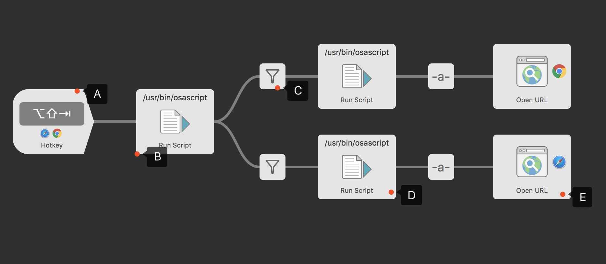

## 背景
今天在  [reddit](https://www.reddit.com/r/macapps/comments/8wr981/safari_extension_open_in_other_browsers_free/) 上看到一个 Safari 插件，作用是在 Safari 上加一个按钮，点击后切换到其他浏览器打开当前页面。 但是这货居然要价 $2.99 ，感觉不值得，所以动手简单实现了一个，就有了今天的这个 Workflow。

## 功能介绍
使用快捷键，切换其他浏览器打开当前 Web 页面的。
**当前只做了 Safari 和 Chrome 间的相互切换**（因为我没用其他的浏览器😁）。

举例子：
- 当前用 Safari 打开了“页面A”，使用快捷键可以快速调用 Chrome 打开“页面A”
- 当前用 Chrome 打开了“页面A”，使用快捷键可以快速调用 Safari 打开“页面A”

> 若想修改成其他浏览器的组合，其实也很简单。下面会介绍的。

## 实现逻辑

- 第一步A：设置快捷键，并设置在特定的应用下生效
- 第二步B：获取当前浏览器的Name
- 第三步C：若是Safari，则走上面分支，若是Chrome则走下面分支
- 第四步D：获取当前 table 页的URL
- 第五步E：用另外的浏览器打开URL